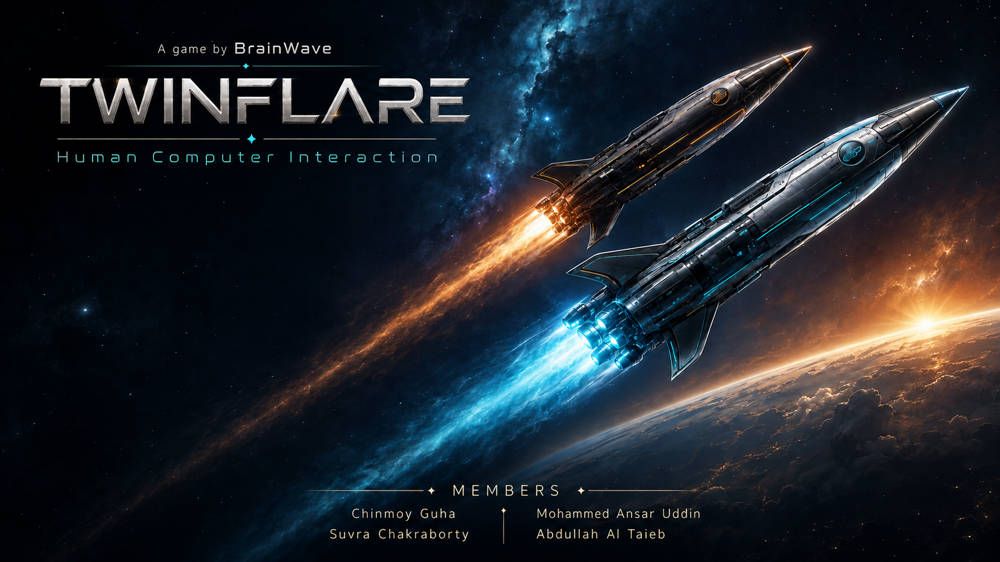

# Twinflare



A tangible user interface project for the HCI course at AIUB by team BrainWave. Two handheld cardboard rockets, each with a tilt sensor and a thumb trigger, steer and fire in a 2D browser game. One Arduino Uno reads both rockets and streams their state to the browser over USB. The browser runs the game and sends short feedback commands back for a damage LED on each rocket and a shared buzzer.

Team members: Chinmoy Guha, Mohammed Ansar Uddin, Abdullah Al Taieb, Suvra Chakraborty.

## Repository map

| Path | What it is |
|---|---|
| `rocket-game/` | The browser game: vanilla HTML, CSS and JavaScript with Canvas 2D, no build step. Keyboard play works without hardware. |
| `rocket-firmware/` | Arduino sketches: five diagnostics in upload order plus the combined `twinflare_firmware`. |
| `Twinflare-Physical-Assembly-Tutorial.md` | Step-by-step breadboard assembly with the complete pin map. |
| `figures/` | Circuit diagram (SVG and PNG). |

## Run the game

Web Serial and ES modules both need `http://localhost`, not a `file://` URL. Use desktop Chrome or Edge.

```bash
cd rocket-game
python -m http.server 8000
```

On macOS use `python3 -m http.server 8000`. Open http://localhost:8000. Keyboard: P1 steers with A/D and fires with Space, P2 steers with the arrow keys and fires with Enter. P or Esc pauses. Modes: Practice, Solo Mission (90 s, target score) and Co-op Mission (shared arena, shared timer, combined score).

The title wallpaper above is the menu background. After each round the debrief screen shows the score, time, course seed and a per-player table. Solo Mission also saves your best score in the browser and marks a new best. Co-op names the rocket with the higher score (or a draw) and shows the team result below it.

Tests run under Node without a browser:

```bash
cd rocket-game
node --test tests/*.test.js
```

## Hardware

One Arduino Uno R3, two GY-521 (MPU6050) modules at I2C addresses 0x68 and 0x69, one bidirectional 3.3 V / 5 V I2C level converter, two pushbuttons, two red LEDs with 1k resistors, one 5 V active buzzer driven by a PN2222A transistor, breadboards and jumper wires. The full parts list, wiring table and pin map are in the assembly tutorial.

Playing with the hardware: plug in the Uno, start the server, open the game in Chrome or Edge, choose Connect Arduino and pick the Uno's port (`COMx` on Windows, `cu.usbserial-…` or `cu.wchusbserial…` on macOS, where the CH340 driver is built in). Keep both rockets still for 2 seconds until the Systems panel reports Healthy, hold them level with triggers released, click Calibrate, then launch a mission.

Flash order and pass criteria for each sketch are in `rocket-firmware/README.md`. In short: install Arduino IDE 2.x, select Arduino Uno and the board's COM port, upload the diagnostics one at a time and check each result in the Serial Monitor at 115200 baud, then upload `twinflare_firmware`, close the Serial Monitor and connect from the game's Systems panel.

## How the two sides talk

The Uno sends one line every 20 ms:

```text
R1,<sequence>,<uptime ms>,<P1 roll>,<P1 fire>,<P1 health>,<P2 roll>,<P2 fire>,<P2 health>
```

Roll is in hundredths of a degree, fire is 0 or 1, health is 0 starting, 1 valid or 2 fault. The browser owns all game logic and sends back `H,1` or `H,2` (hit: flash that LED and beep), `B,1` and `B,2` (countdown and end beeps), `X` (clear outputs) and `M,1` or `M,0` (mute or unmute).

## Status

Bench-tested on 11 September 2026: all diagnostics pass, both sensors stream at 50 Hz, the browser parses the stream and the feedback commands work. Open item: one rocket's sensor connection is intermittent when its cable moves and needs rewiring or a replacement module. The bench log in `rocket-firmware/README.md` has the details.
